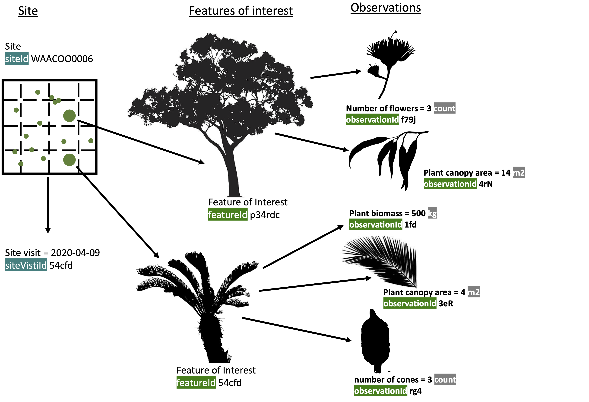
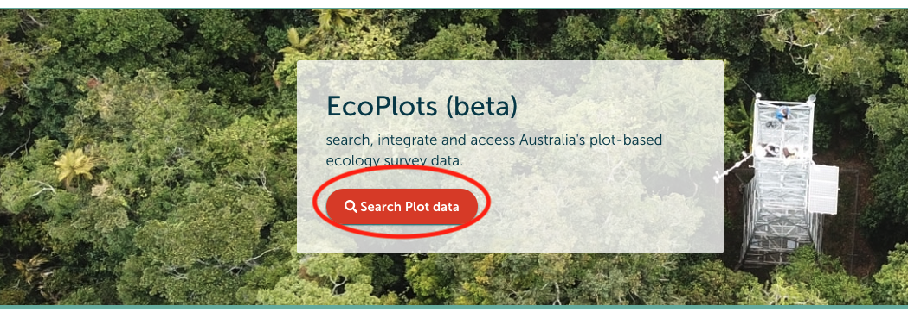
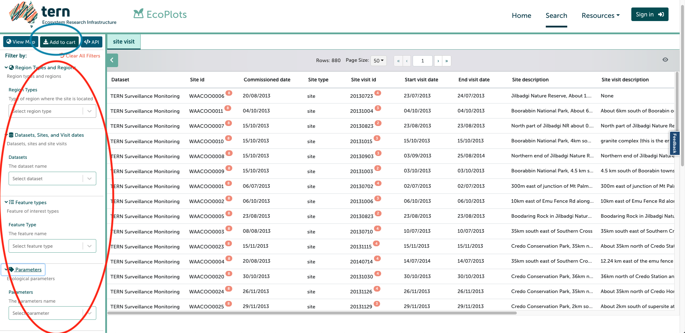
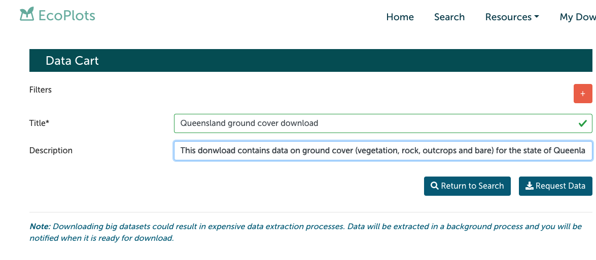
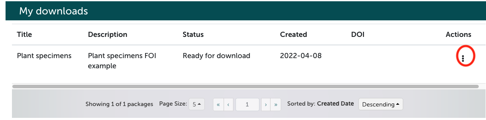
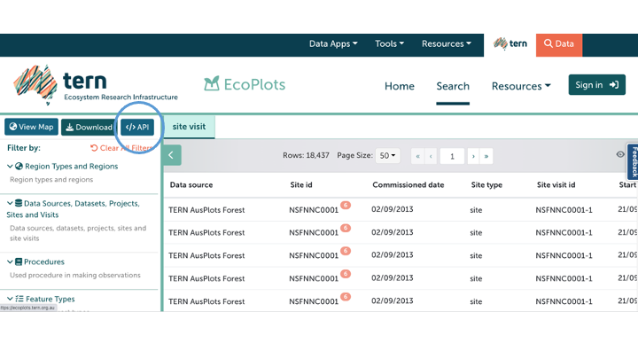
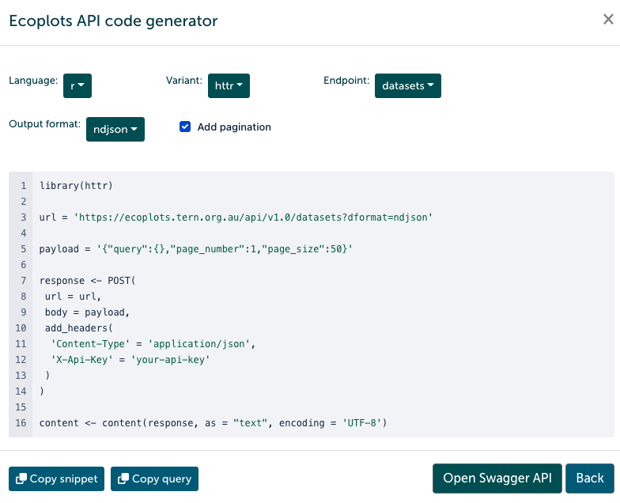

```{r setup, include=FALSE}
knitr::opts_chunk$set(echo = TRUE)
library(tidyverse)
library(kableExtra)
library(fs)
library(easystats)
library(bookdown)
library(ggplot2)
```

This workshop will demonstrate how to manipulate TERN's [EcoPlots's](https://ecoplots.tern.org.au/) plot ecological data downloads using R. This document uses the following libraries: `tidyverse`, `kablExtra`, `fs`, `easystats`,`ggplot2` and `bookdown` libraries.

# What is EcoPlots?

Ecoplots is a database that harmonises plot based ecology data from different sources to enable integrated search and access to data based on different jurisdiction, data sources, feature types, parameters and temporal extent.

EcoPlots's ecological data model is observation- and site-centric. Typically, an observations will belong to a site and will have a site-visit (see Figure below for a graphical representation of concepts and their association).

Observations (e.g. number of flowers, plant canopy area and plant biomass in \@ref(fig:datamodel)) are done on [features of interest](https://linkeddata.tern.org.au/information-models/tern-ontology/conceptual-information-model#feature-of-interest) (real world objects you are interested in studying, measuring or observing; the plants (Eucalyptus and Cycad) in Figure \@ref(fig:datamodel)).

All entities in the data model have:

-   id's (e.g. observations, FOI's, vocabularies, methods and instruments)

-   Unique Resource Identifiers i.e. (unique sequence of characters) are used for generating the id's

-   The URI's can be used to locate and get information about that entity (e.g. check out the URI for animal occurrence here <http://linked.data.gov.au/def/tern-cv/2361dea8-598c-4b6f-a641-2b98ff199e9e>)

-   Multiple observations can be done in a feature of interest (FOI). In figure \@ref(fig:datamodel) the Eucalyptus tree (FOI p34rdc) has observations on number of flowers and plant canopy.

-   Data downloaded from the EcoPlots plataform comes in a longer format.

-   `featureId` and `observationId` are unique keys for a feature and observation, respectively. These two identifiers are the work-horses for joining and transforming tables (e.g. from the longer to a wider format).

-   See the [TERN Ontology](https://linkeddata.tern.org.au/information-models/overview) for more information on our data model and [the conceptual overview of the model](https://linkeddata.tern.org.au/information-models/tern-ontology/conceptual-information-model).


```{r datamodel, echo=FALSE, fig.align='center', out.width='150%', fig.cap="Ecological Data Representation in TERN's data model"}

```


# TERN's data model

First things first, some background:

-   The TERN data model is observation-centric

-   Each observation belongs to a [feature of interest](https://linkeddata.tern.org.au/information-models/tern-ontology/conceptual-information-model#feature-of-interest) (FOI, i.e. the real world object you are interested on and are measuring things about)

-   This model differentiate between [parameters](https://linkeddata.tern.org.au/information-models/tern-ontology/conceptual-information-model#observations) (i.e. observations, things that are measured directly on the FOI) and [attributes](https://linkeddata.tern.org.au/information-models/tern-ontology/conceptual-information-model#non-core-attributes) (measurements related to to the FOI and other data entities).

-   TERN Ontology's main focus is to represent site-based ecological surveys. Meaning, that [site](https://linkeddata.tern.org.au/information-models/tern-ontology/conceptual-information-model#site) and [site visits](https://linkeddata.tern.org.au/information-models/tern-ontology/conceptual-information-model#site-visit) are central to the description of the observations (the model can also describe other data types, e.g. occurrence data)

    -   A [site](http://linked.data.gov.au/def/tern-cv/5bf7ae21-a454-440b-bdd7-f2fe982d8de4) is a land area selected from within a survey region where the sampling occurs (e.g. plot, transect, quadrat).
    -   [site-visits](http://linked.data.gov.au/def/tern-cv/f5c125b1-81c2-448c-81e6-7ff6a2facd07) are a discrete time when the surveys within the site occurred.

An FOI can have many observations. You can make observations on the height, diameter, wood density of a single tree (see Figure \@ref(fig:datamodel)). Similarly, observations and FOIs can have multiple attributes. For instance, reliability and/or accuracy of an observation are attributes, as well as notes on an observation or sample sizes.


# EcoPlots download

To download Ecoplots data visit the portal <https://ecoplots.tern.org.au/>. Once in there click on the search plot data button to explore (cirlced in red in the figure below, Figure \@ref(fig:landing))

```{r landing, echo=FALSE, fig.align='center', fig.cap="EcoPlots landing page"}

```

Below you can see a snapshot of the EcoPlots data grid (Figure \@ref(fig:grid)). Using the facets (marked in red on the left hand side of Figure \@ref(fig:grid)) you can filter to specific databases, regions, feature types, parameters and dates (not shown). Once you have selected the data that you want to query you can trigger a download clicking the add to cart button (top left corner, marked in blue in Figure \@ref(fig:grid)). After adding items to your cart, if you have not already done so, you will be prompted to sign in to download the data.

```{r grid, echo=FALSE, fig.align='center', fig.cap="EcoPlots facets and data grid"}

```

In the download page you can give your download a title and description (see Figure \@ref(fig:download)).

```{r download, echo=FALSE, fig.align='center', fig.cap="EcoPlots download"}

```

Once you received your download you can always come back to it later (up to two weeks) and if you want to you can keep a permanent copy of it to share by minting a DOI (Figure \@ref(fig:doi) under actions button circled in red)

```{r doi, echo=FALSE, fig.align='center', fig.cap="EcoPlots download mint"}

```

Now let's look at a EcoPlots download. IN the code chunk below we show a download example for [plant specimen data](http://linked.data.gov.au/def/tern-cv/2e122e23-881c-43fa-a921-a8745f016ceb) from the TERN Ecosystem Surveillance database [@Sparrow2022].

An EcoPlots download comes in a `package` that contains:

-   `bag-info.txt` with:

    -   **citation**
    -   link to the metadata record
    -   licensing
    -   download information (e.g. link and download date)

-   data folder that contains:

    -   Citation in a `.bib` format **citation.bib**

    -   Site and site attributes file

        -   If other sampling units are used then a file for the sampling unit is included. A transect file is included when the sampling takes place inside a transect inside a site.

    -   Site visit and site visit attributes file

    -   FOI observations file

    -   FOI attributes file

        -   If the FOI is an organism then a taxon file is included

    -   Data dictionary for all columns in all files

Structure and relationships between the data types are provided using URI's. All definitions, methods, and even observations in a data download will have a URI, in the tables this URIs are identified with the `Id` suffix.

You can also download the data using the Application Programing Interface (API). To do this, after selecting which data you want in the EcoPlots faceted search, you can click on the API tab (next to the Download tab).

```{r, echo=FALSE, fig.align='center', out.width='150%',out.height='150%',fig.cap="EcoPlots API tab"}

```

Once you have clicked on this tab, you can select which programing language, endpoint and output format you would like. Once the language is selected, it will automatically generate code that queries the API. You can then use this code to extract the requested data.


```{r, echo=FALSE, fig.align='center', fig.cap="EcoPlots API code generator"}

```

Note: you will need to have an API "key" to use this function. Further information regarding using the API and how to obtain an API key can be found here[TERN API](https://ecoimages.tern.org.au/api/v1.0/ui).

# Data formatting - Long to wide format

The basic columns of the longer format tables are:

-   `featureType` is a human readable name for the feature which observation we are interested on. A complete list of all feature types can be found [here](https://linkeddata.tern.org.au/viewer/tern/id/http://linked.data.gov.au/def/tern-cv/68af3d25-c801-4089-afff-cf701e2bd61d)
-   `featureId` column contains single unique identifier for each individual feature
-   `parametersName` column that contains the names of the columns in the wide format
-   `result` column for sourcing the values that will be used to fill in the named columns above

In general, the conversion from longer to wider format should be achieved by using `featureType` and `featureId` as unique identifiers, the `parametersName` that literally contains the name of the parameters performed on the FOI (observations) and `result` that is the value for a given observation. We will now work though a basic example of formatting and visualising biomass data downloaded from EcoPlots

## Biomass data across Ecosystems

First load required packages:

```{r}
library(tidyverse)
library(kableExtra)
library(fs)
library(easystats)
library(bookdown)
library(ggplot2)
```

We assume that the biomass data has been downloaded following the instructions in section 3.

Once the data is downloaded:

1.  Load the plant individual observation table

```{r message=FALSE, warning=FALSE}
#load plant individual observations
plant_ind <- read_csv("Biomass_ESA_2022/biomass_data/data/plant-individual_observations_8c26e0544c3820d969fe805f6519834f.csv", na = "N/A")
```

2.  Transform the table from their long format to a wider format.

-   In the case of the plant individual observation data we can separate the parameter values into the groups that we need (e.g. diameter at breast height, vegetative height, aboveground biomass etc).

```{r,warning=FALSE}
#separate parameters (e.g. diameter at breast height, vegetative height, aboveground biomass) into wide format.  For this example we will retain the site name, longitude, latitude, date of sampling (siteVisitName) and the featureId 

plant_ind %>%
pivot_wider(id_cols=c(siteName,latitude,longitude,siteVisitName,featureId),names_from = parameter,values_from= result) -> plant_ind_wide

# convert to a dataframe

plant_ind_wide_dat<-as.data.frame(plant_ind_wide)

#amend the "scientific name" and "above-ground biomass"" column names to "scientific_names" and "Woody above ground biomass", respectively.
colnames(plant_ind_wide_dat)[10]<-"Scientific_name"
colnames(plant_ind_wide_dat)[14]<-"Woody_above_ground_biomass"


# amend the siteVisitName (date) column name to only provide the year of sampling only (first four digits)

plant_ind_wide_dat$year<-substr(plant_ind_wide_dat$siteVisitName,1,4)
```

3.  We will aggregate above-ground biomass by site and sampling year and visualise the result

```{r message=FALSE}
#before we aggregate the data, we need to convert "above ground biomass" to a numeric value

plant_ind_wide_dat$Woody_above_ground_biomass<-as.numeric(plant_ind_wide_dat$Woody_above_ground_biomass)

#aggregate by site and sampling year

plant_ind_wide_dat%>%
	group_by(siteName,year)%>%
	summarize(site_level_biomass_kgs=sum(Woody_above_ground_biomass,na.rm=TRUE))->summed_site_level_biomass

#plot sites where biomass was sampled in 2015

site_biomass_for_plotting<-subset(summed_site_level_biomass,year=="2015")

## convert kgs to tonnes/ha

site_biomass_for_plotting$above_ground_biomass_tonnes_per_ha<-site_biomass_for_plotting$site_level_biomass_kgs/1000

plot1<-ggplot(site_biomass_for_plotting, aes(x = siteName, y = above_ground_biomass_tonnes_per_ha))+geom_bar(stat="identity",fill="grey65")+labs(x="Site",y="Above ground biomass (tonnes/ha)")

plot1+theme_bw() +theme(axis.text.x = element_text(angle = 45, hjust = 1))
```


4.  Now we will aggregate the above-ground biomass by species within sites, by sampling year.

```{r message=FALSE}
#aggregate above-ground biomass by site, date and species name

plant_ind_wide_dat%>%
	group_by(siteName,year,Scientific_name)%>%
	summarize(species_level_biomass_kgs=sum(Woody_above_ground_biomass,na.rm=TRUE))->summed_species_level_biomass
```

5.  Create figure that show the change in species above-ground biomass in a site over different time periods.

```{r}
#using the Alice Mulga site as an example, we can graph the change in above-ground biomass for each species over time

#subset data for the Alice Mulga site

Alice_mulga<-subset(summed_species_level_biomass,siteName=="NTABRT0002")

#plot species biomass by year

plot2<-ggplot(Alice_mulga, aes(x = Scientific_name, y = species_level_biomass_kgs,fill=year))+geom_col(position="dodge")+labs(x="Species",y="Above ground woody biomass (kg)")

plot2+theme_bw() +theme(axis.text.x = element_text(angle = 45, hjust = 1))
```


# References

[Sparrow, B., A. Tokmakoff, E. Leitch, G. Guerin, S. O'Neill, C. Macdonald, A. Lowe, et al. 2022. "TERN Surveillance Monitoring Program: Ecological Plot Survey Data and Samples Collected from Field Sites Across Australia." Terrestrial Ecosystem Research Network (TERN).](https://portal.tern.org.au/tern-surveillance-monitoring-sites-australia)

[Meyer, W. (2022): Calperum Mallee Stem Diameter, Height and Aboveground Woody Biomass Data. Version 1.0. Terrestrial Ecosystem Research Network. (Dataset).](<https://portal.tern.org.au/calperum-mallee-stem-biomass-data/23822)

[Cleverly, J. (2022): Alice Mulga Stem Diameter, Height and Aboveground Woody Biomass Data. Version 1.0. Terrestrial Ecosystem Research Network. (Dataset).](https://portal.tern.org.au/alice-mulga-stem-biomass-data/23499)

[Boer, M., Pendall, E. (2022): Cumberland Plain Stem Diameter, Height and Aboveground Woody Biomass Data. Version 1.0. Terrestrial Ecosystem Research Network. (Dataset).](https://portal.tern.org.au/cumberland-plain-stem-biomass-data/23504)

[Keith, H., Stol, J., Woodgate, W. (2022): Tumbarumba Wet Eucalypt Stem Diameter, Height and Aboveground Woody Biomass Data. Version 1.0. Terrestrial Ecosystem Research Network. (Dataset).](https://portal.tern.org.au/tumbarumba-wet-eucalypt-biomass-data/23510)

[Lollback, G., Hero, J. (2022): Karawatha Peri-urban Diameter, Height and Aboveground Woody Biomass Data. Version 1.0. Terrestrial Ecosystem Research Network. (Dataset).](https://doi.org/10.25901/f68a-aq94)

[Bradford, M., McKeown, A., Ford, A., Liddell, M. (2022): Robson Creek Rainforest Diameter, Height and Aboveground Woody Biomass Data. Version 1.0. Terrestrial Ecosystem Research Network. (Dataset).](https://portal.tern.org.au/robson-creek-rainforest-biomass-data/23823)
